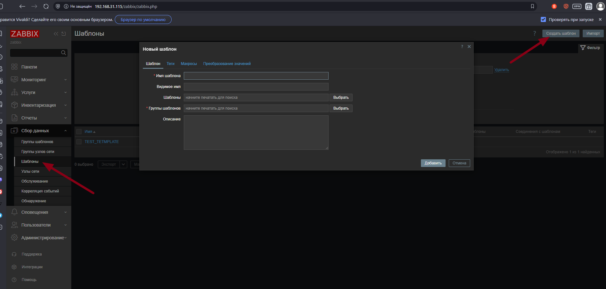
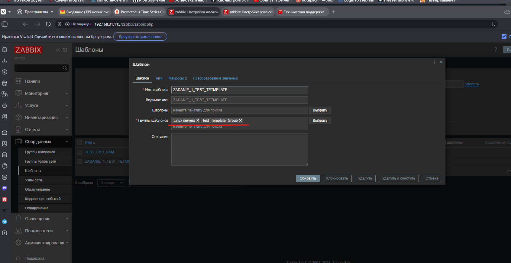
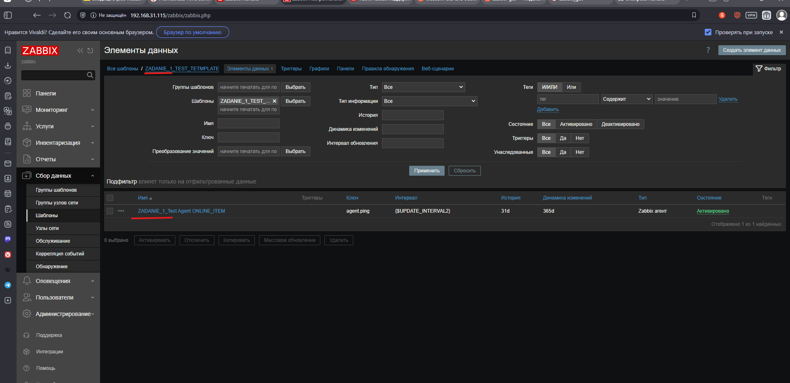
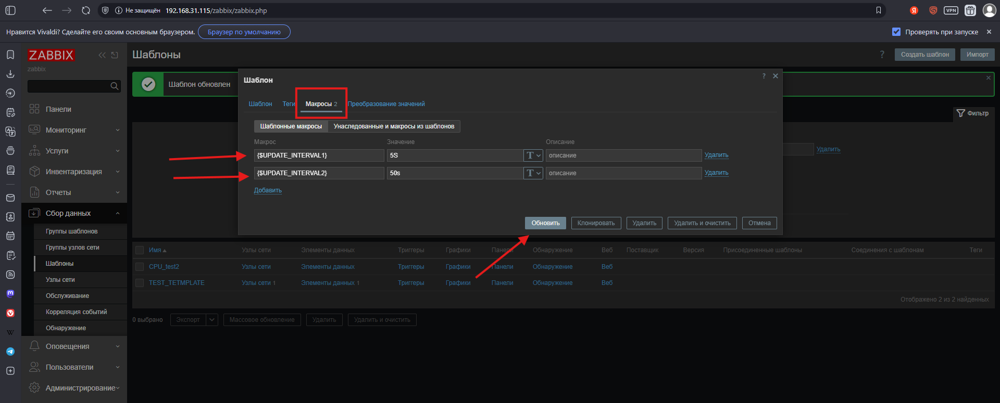
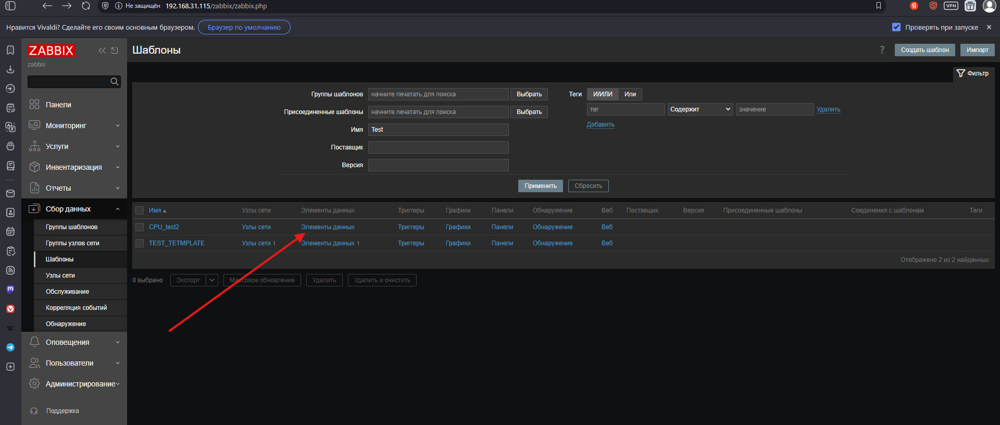
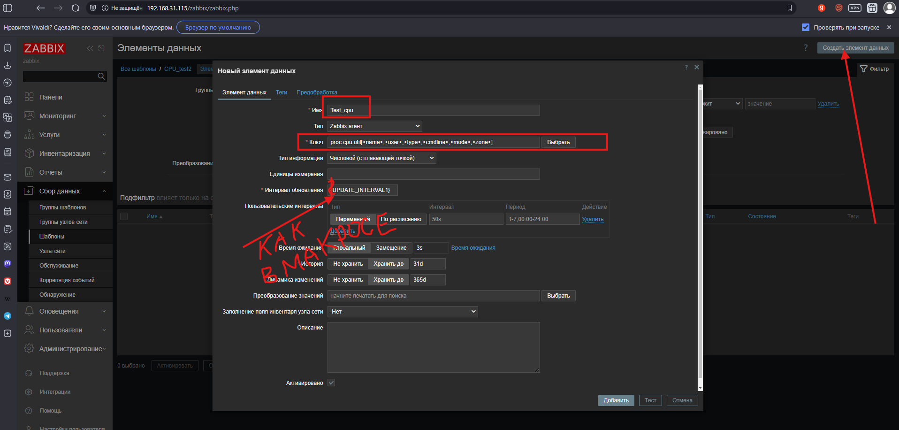
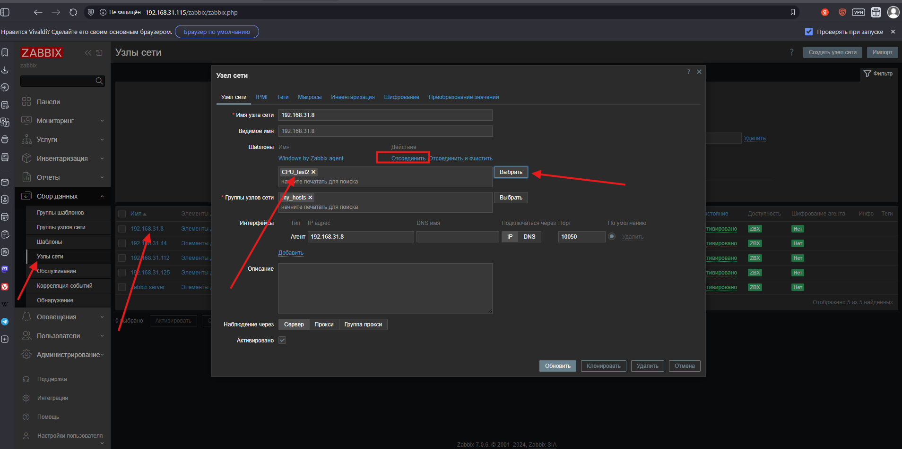
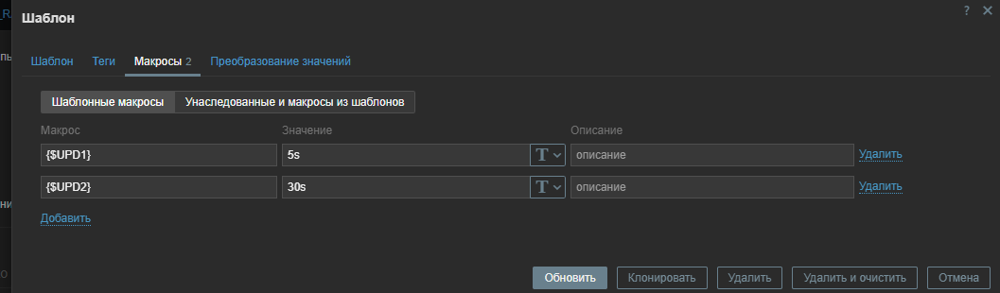
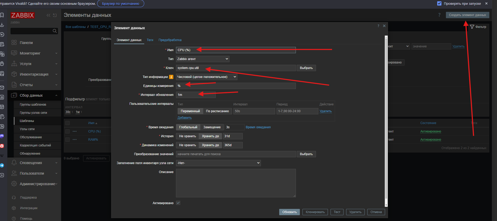
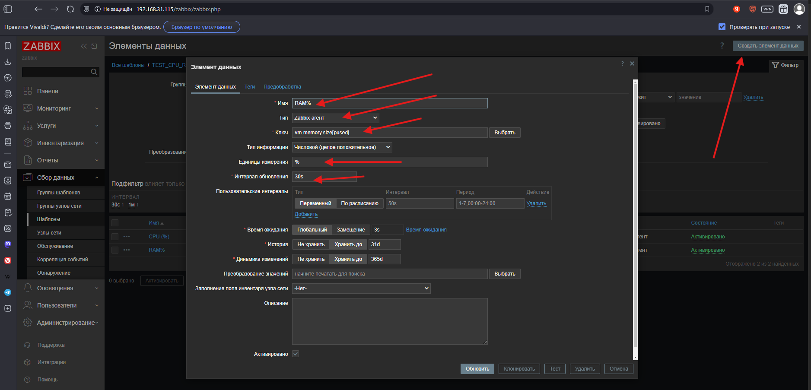

# ZABBIX_CONFIG2
## Задание 1
Создайте свой шаблон, в котором будут элементы данных, мониторящие загрузку CPU и RAM хоста.

# Процесс выполнения
1. Выполняя ДЗ сверяйтесь с процессом отражённым в записи лекции.
2. В веб-интерфейсе Zabbix Servera в разделе Templates создайте новый шаблон
3. Создайте Item который будет собирать информацию об загрузке CPU в процентах
4. Создайте Item который будет собирать информацию об загрузке RAM в процентах
Требования к результату
 Прикрепите в файл README.md скриншот страницы шаблона с названием «Задание 1»

## Ответ 
1. Создаем новый шаблон
 

 
 -----------------
 

Добавим свой макрос
Укажем параметры обновления 5s и 50s
 
 Создаем item
 
 СоздаетДанные
 

 Привязываем шаблон к хосту
 

 --------------
 ### создаем шаблоны для CPU и RAM

 

 

 

 

 прикручиваем шаблон к хосту
 
 
 
 
 обновляем данные
 
 Идем смотреть что получилось
 так же можно потыкать в графики
 
 

## Задание 2
Добавьте в Zabbix два хоста и задайте им имена <фамилия и инициалы-1> и <фамилия и инициалы-2>. Например: ivanovii-1 и ivanovii-2.

Процесс выполнения
Выполняя ДЗ сверяйтесь с процессом отражённым в записи лекции.
Установите Zabbix Agent на 2 виртмашины, одной из них может быть ваш Zabbix Server
Добавьте Zabbix Server в список разрешенных серверов ваших Zabbix Agentов
Добавьте Zabbix Agentов в раздел Configuration > Hosts вашего Zabbix Servera
Прикрепите за каждым хостом шаблон Linux by Zabbix Agent
Проверьте что в разделе Latest Data начали появляться данные с добавленных агентов
Требования к результату
 Результат данного задания сдавайте вместе с заданием 3

 

## Задание 3
Привяжите созданный шаблон к двум хостам. Также привяжите к обоим хостам шаблон Linux by Zabbix Agent.

Процесс выполнения
Выполняя ДЗ сверяйтесь с процессом отражённым в записи лекции.
Зайдите в настройки каждого хоста и в разделе Templates прикрепите к этому хосту ваш шаблон
Так же к каждому хосту привяжите шаблон Linux by Zabbix Agent
Проверьте что в раздел Latest Data начали поступать необходимые данные из вашего шаблона
Требования к результату
 Прикрепите в файл README.md скриншот страницы хостов, где будут видны привязки шаблонов с названиями «Задание 2-3». Хосты должны иметь зелёный статус подключения

## Задание 4
Создайте свой кастомный дашборд.

Процесс выполнения
Выполняя ДЗ сверяйтесь с процессом отражённым в записи лекции.
В разделе Dashboards создайте новый дашборд
Разместите на нём несколько графиков на ваше усмотрение.
Требования к результату
 Прикрепите в файл README.md скриншот дашборда с названием «Задание 4»

